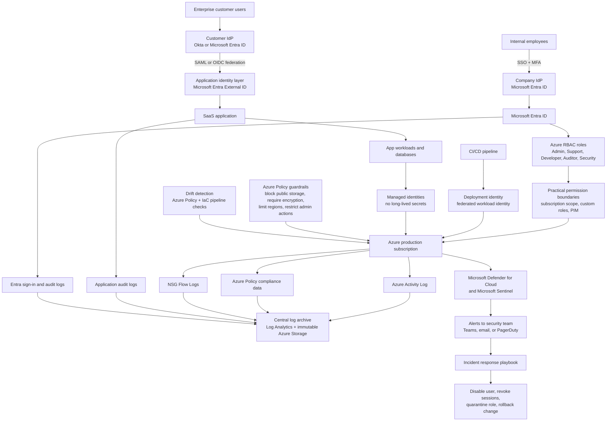

# Secure Cloud Architecture Design for a Healthcare SaaS Company

**Chosen regulated market:** Healthcare

## Part A - Architecture Diagram

- **Identity layer:** Enterprise customers sign in with their own IdP by using SAML or OIDC federation into the SaaS login through Microsoft Entra External ID. Internal staff use Microsoft Entra ID for workforce access. MFA is required for all privileged users, and stronger factors such as FIDO2 keys should be used for admin access.
- **Authorization layer:** Access is based on Azure RBAC roles for admins, developers, support, auditors, and security staff. Practical permission boundaries come from subscription scope, custom roles, and Microsoft Entra PIM so privileged access is temporary and limited. Human access comes from SSO, while machine access uses managed identities and federated workload identities instead of stored secrets.
- **Visibility layer:** Azure Activity Log, Entra sign-in logs, Azure Policy compliance data, NSG Flow Logs, and application audit logs are all sent to centralized monitoring and archive storage. Alerts should exist for failed MFA, risky sign-ins, unusual role elevation, policy changes, public storage exposure, and high-severity Defender findings.
- **Policy layer:** Preventative guardrails are enforced with Azure Policy deny rules and scoped RBAC assignments, while detective guardrails use Azure Policy audit rules, Defender for Cloud, and Sentinel analytics. Drift detection is handled through Azure Policy compliance checks and infrastructure-as-code checks in the deployment pipeline.
- **Response layer:** A likely incident would be detected through Microsoft Defender for Cloud, Microsoft Sentinel, Azure Monitor, or Entra risky sign-in alerts. Containment would start by disabling the user account, revoking active sessions, isolating the affected identity or workload, and rolling back the latest deployment if needed.

## Part B - Compliance Mapping Table

| Course arc | Requirement | Technical control | Tool or service | Evidence |
|---|---|---|---|---|
| Identity | Restrict access to authorized personnel only | SSO with role-based access and quarterly access reviews | Microsoft Entra ID + Azure RBAC + Entra access reviews | Access review report, role assignment export, Azure Activity Log records |
| Identity | Require strong authentication for privileged access | MFA for admins, developers, and support staff who can reach sensitive healthcare data | Microsoft Entra MFA + Conditional Access + PIM | MFA policy settings, sign-in logs, risky sign-in alerts |
| Visibility | Retain audit logs for compliance and audits | Centralized log storage with encryption, immutability, and long-term retention | Azure Activity Log + Entra audit logs + Log Analytics + immutable Azure Storage | Retention policy, immutable storage settings, sample audit logs |
| Visibility | Detect suspicious activity quickly | Automated alerts for unusual sign-ins, anomalous privilege use, and security findings | Microsoft Defender for Cloud + Microsoft Sentinel + Azure Monitor | Alert history, incident tickets, Defender findings |
| Policy | Enforce a secure cloud baseline | Prevent public storage, require encryption, and restrict unapproved regions and services | Azure Policy + management groups | Policy assignments, compliance dashboard, exception records |
| Policy | Control production changes while keeping weekly releases | Use infrastructure as code, pull request approval, and a separate deploy identity for production | GitHub Actions + Terraform or Bicep checks + federated workload identity | Pull request approvals, pipeline logs, deployment records |

## Part C - Incident Response Outline

**Incident scenario:** A developer's SSO account is compromised, and the attacker tries to deploy an unauthorized production change.

- **Detection:** The incident would likely be discovered through a Microsoft Entra risky sign-in alert, followed by an unexpected production deployment workflow run and Azure Activity Log records from the deploy identity. Defender for Cloud or Sentinel would then raise a higher-priority alert if the behavior looked abnormal.
- **Evidence:** I would collect Entra sign-in logs, Entra audit logs, Azure Activity Log events for role assignment and deployment actions, GitHub Actions pipeline logs, Azure Policy compliance history, and relevant application audit logs.
- **Containment:** The first steps would be to disable the user in Microsoft Entra ID, revoke active sessions, pause the deployment pipeline, temporarily disable the production deploy identity, and roll back any unauthorized change that already reached production.
- **Remediation:** To stop this from happening again, I would strengthen conditional access rules, shorten privileged session duration, require stronger MFA for deployment access, and add a second approval step before production deployment.

## Brief Justification of Key Design Decisions

I chose healthcare because it is a clear example of a regulated market where identity, logging, and audit readiness matter a lot. I used federated SSO because enterprise customers usually already have an IdP, and this lowers password risk while making onboarding easier. I also centralized logs in protected Azure monitoring and storage services because that supports audits and makes it harder for an attacker to delete evidence.

Another important decision was separating human access from machine access. This adds some setup work, but it keeps least privilege more realistic and supports weekly deployments through a controlled CI/CD pipeline instead of manual production changes.

## Reflection

The main tradeoff in this design is that stronger security controls add more cost and a bit more operational complexity. For example, centralized logging, Defender for Cloud, Azure Policy, and stricter role design all improve compliance, but they also need more setup and monitoring. To balance that, I kept weekly deployments by using automation and role-based approvals rather than slowing everything down with manual changes.

If I had more time and budget, I would add stronger Sentinel tuning, just-in-time privileged access, better device compliance checks, and regular tabletop incident exercises. Those additions would make the environment stronger, but I think the current design is a practical starting point for a mid-sized company.
